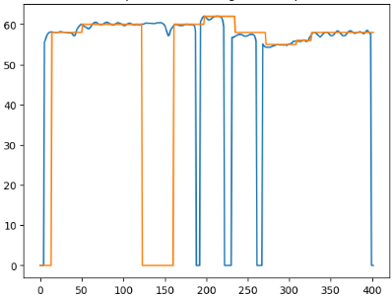
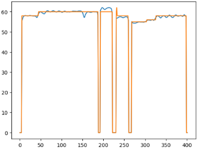
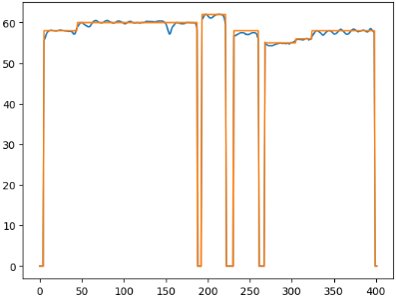
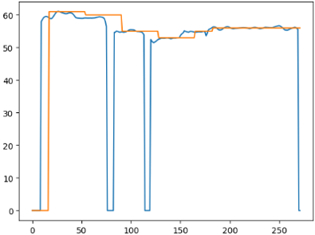
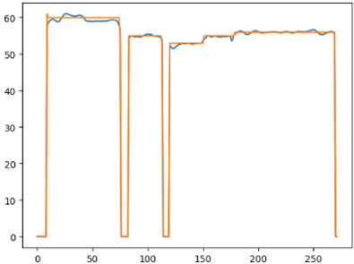
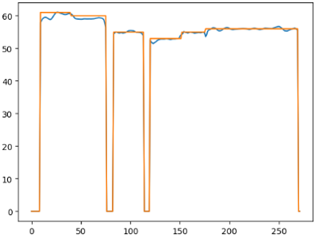
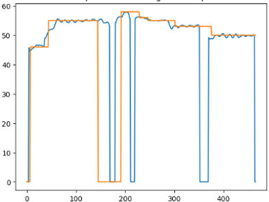
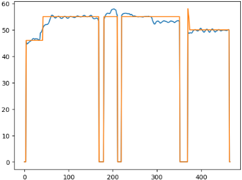
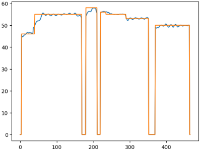

# 🎼 Vocal-MIDI Aligner
**vocal-midi-aligner** is a Python library for aligning sung vocal pitch contours (from `.wav` files) with symbolic note sequences (from `.mid` files).  
It improves upon traditional DTW (Dynamic Time Warping) by incorporating additional features like note duration, silence handling, and unvoiced penalties for more accurate alignment. Unlike standard DTW, this allows multiple vocal frames to align with a single note. This leads to a multi-step DTW formulation that better reflects the temporal structure of singing.

---

### ✅ Features

- **Silence-aware boundary matching**  
  Detects leading and trailing silence in vocals and aligns accordingly.
  
- **Multi-factor alignment cost**  
  - `lambda_pitch`: Pitch mismatch weight  
  - `lambda_duration`: Note duration mismatch weight  
  - `lambda_unvoiced`: Penalty for mismatched voiced/unvoiced frames

- **Duration-aware DTW**  
  Prevents extreme stretching/compression by incorporating note durations into the cost matrix.

---

## 📦 Installation

```bash
git clone https://github.com/HGU-DLLAB/vocal-midi-aligner.git
cd vocal-midi-aligner
pip install -r requirements.txt
```

## 🎵 Basic Usage Example

```python
import numpy as np
import matplotlib.pyplot as plt

from aligner.vocal_note_align import VocalNoteAlign

wav_path = "YOUR_WAV_FILE_PATH"
midi_path = "YOUR_MIDI_FILE_PATH"

# Create the aligner object
aligner = VocalNoteAlign(
    lambda_pitch=3,       # Weight for pitch difference
    lambda_duration=0.1,  # Weight for duration mismatch
    lambda_unvoiced=20,   # Penalty for unvoiced/silence mismatch
    sampling_rate=22050,
    hop_length=256
)

# Perform alignment
vocal_pitch, aligned_note_pitch = aligner.multi_process_run(wav_path, midi_path)

plt.title("Vocal Pitch and Aligned Note Pitch")
plt.plot(vocal_pitch, label="Vocal Pitch")
plt.plot(aligned_note_pitch, label="Aligned Note Pitch")
plt.legend()
plt.show()
```

---

## Results

Below are comparisons between standard single-step DTW and duration-aware multi-step DTW on three vocal samples.

### Sample 1
| (1) Before Alignment | (2) Standard DTW (Single-step) Result | (3) Multi-step DTW |
|:-----------:|:-----------------:|:-------------------:|
|  |  |  |

---

### Sample 2
| (1) Before Alignment | (2) Standard DTW (Single-step) Result | (3) Multi-step DTW |
|:-----------:|:-----------------:|:-------------------:|
|  |  |  |

---

### Sample 3
| (1) Before Alignment | (2) Standard DTW (Single-step) Result | (3) Multi-step DTW |
|:-----------:|:-----------------:|:-------------------:|
|  |  |  |
